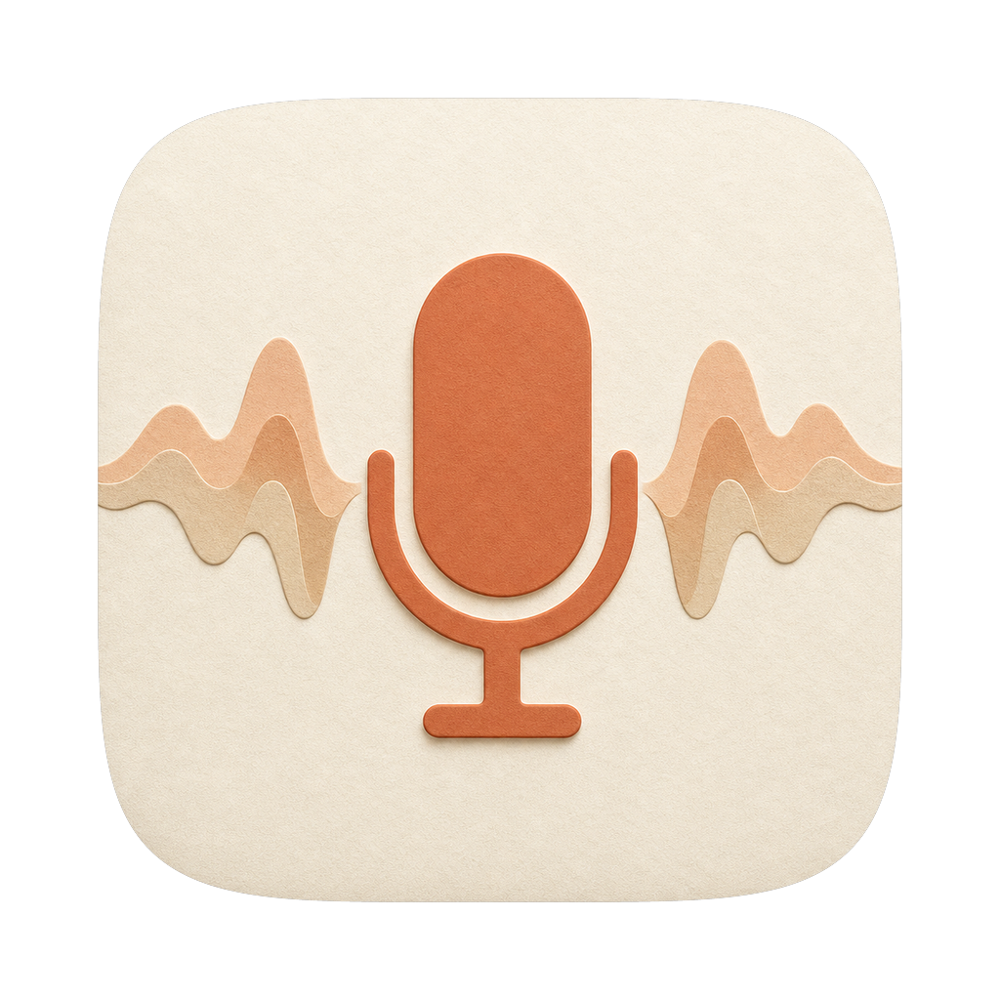

# Whisper

A macOS menu-bar dictation app — hold **Fn**, speak, release, and the AI-corrected text is pasted into whatever you're typing. Think Wispr Flow, powered by Groq with a single free API key.

**Website:** https://gamezxz.github.io/WhisperApp/



> The app is named **Whisper** (v1.2+); the repo/bundle keeps the historical name `WhisperApp`.

## Features

- 🎙️ **Global hotkey** — default is the **Fn key alone**, hold-to-talk; toggle mode: double-tap to start, single tap to stop. Fully configurable in Settings.
- ⚡ **One key, one provider** — a single Groq API key powers both transcription (`whisper-large-v3-turbo`) and AI correction (`llama-3.3-70b-versatile`)
- ✨ **AI text correction** — fixes garbled words and adds punctuation before pasting
- 📋 **Auto-paste** into the focused app (simulates ⌘V)
- 🌊 Live waveform + status overlay (recording → transcribing → fixing → done)
- 🔒 Key stored locally (`~/.whisperapp/` or `GROQ_API_KEY` in your shell), never bundled or shipped
- ✅ Signed & **notarized** DMG

## Requirements

- macOS 13+
- **Permissions:** Microphone + Accessibility (for auto-paste)
- A free Groq API key from [console.groq.com](https://console.groq.com)

## Install

1. Download `Whisper-x.x.dmg` from [Releases](../../releases) (or the [website](https://gamezxz.github.io/WhisperApp/))
2. Drag **Whisper** to **Applications**
3. Open it — a mic icon appears in the menu bar
4. **System Settings → Privacy & Security:** enable **Microphone** and **Accessibility**
5. Click the mic icon → **Settings…** → paste your Groq API key
6. Hold **Fn** and speak

## Configure the key

The key is read from (in order): the Settings UI (saved to `~/.whisperapp/`) → shell env (`~/.zshrc`).

```sh
# optional: put the key in ~/.zshrc instead of the Settings UI
export GROQ_API_KEY="gsk_..."
```

## Build from source

```bash
git clone https://github.com/Gamezxz/WhisperApp
cd WhisperApp
./run.sh             # dev loop: build + launch the app
./make_dmg.sh        # build → sign → notarize → staple → .dmg
```

Notarization in `make_dmg.sh` expects a keychain profile named `whisperapp-notary`
(`xcrun notarytool store-credentials`). For a stable signature (so macOS remembers
permissions across rebuilds), sign with your own **Developer ID Application**
certificate — the build scripts auto-detect it.

### Release checklist

1. Bump version in `Info.plist`
2. `./make_dmg.sh`
3. `gh release create vX.Y *.dmg`
4. Update the download link + version badge + JSON-LD (`softwareVersion`, `downloadUrl`) in `docs/index.html`

## Architecture

- SwiftUI menu-bar app (`LSUIElement`), `NSEvent` global hotkey (`HotkeyManager.swift`)
- `AVAudioEngine` → 16 kHz mono Int16 WAV recording
- STT + LLM correction via Groq's OpenAI-compatible API
- Floating `NSPanel` + SwiftUI status overlay
- Provider registries (`STTProvider.swift`, `LLMProvider.swift`) still support other
  OpenAI/Anthropic-compatible endpoints internally, but the Settings UI is Groq-only
- Promo site lives in `docs/` (GitHub Pages, cream/clay theme, full SEO meta)

## License

MIT
